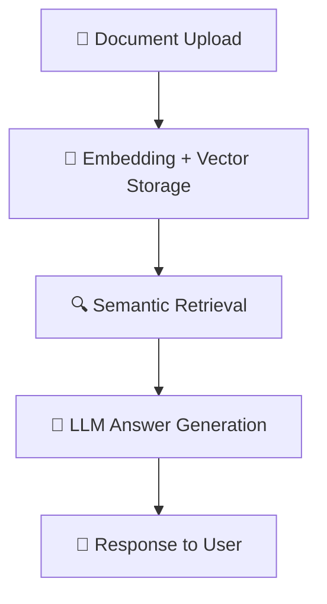

# 🧠 Cogniscope AI


> ⚙️ *Cogniscope AI* is a modular framework for building intelligent conversational and document-understanding systems powered by NLP, embeddings, and Retrieval-Augmented Generation (RAG).

---

## 🚀 Overview

Cogniscope AI bridges **Natural Language Processing** and **Generative AI** to create a unified platform capable of:  
- 🗂️ Extracting and embedding documents (PDFs, FAQs)  
- 💬 Conversing with your data using **Retrieval-Augmented Generation (RAG)**  
- 🤖 Integrating **Azure OpenAI APIs** for chat  
- 🧠 Performing NLP tasks such as **Sentiment Analysis** and **Summarization**  

---

## 🏗️ Project Structure

```
intern-Avanish-Sahai/
│
├── NLP/                         # NLP-focused experiments and notebooks
│   ├── sentiment analysis NLTK.ipynb
│   ├── Sentiment Analysis spacy.ipynb
│   ├── summary.ipynb
│
├── python/
│   ├── app.py                   # Core app / entrypoint
│   ├── chatapi.py               # Chat interface via LLM APIs
│   ├── multichat.py             # Multi-chat orchestration
│   ├── azurechatbotapi.py       # Azure OpenAI chatbot API integration
│   ├── requirements.txt
│
│   ├── Document_processing_api/  # Document processing & embedding layer
│   │   ├── app.py
│   │   ├── embedding.py
│   │   ├── process_pdf.py
│   │   ├── vector_db.py
│   │   ├── config.py
│   │   └── processed/FAQ.pdf
│
│   ├── RAG_processing/           # Retrieval-Augmented Generation pipeline
│       ├── app.py
│       ├── config.py
│       ├── processed/FAQ.pdf
│
└── queries.log                   # Logs for chat or NLP queries
```

---

## 💡 Key Features

| Feature | Description | Tools Used |
|----------|--------------|------------|
| 📄 **Document Embedding** | Parse and embed PDF documents for intelligent retrieval. | PyMuPDF, LangChain, Milvus |
| 🔍 **Vector Database** | Store embeddings and perform semantic search. | Milvus / FAISS |
| 🤖 **Chat Interface** | Chat seamlessly using OpenAI/Azure models. | Azure OpenAI API, Flask/FastAPI |
| 🧠 **Retrieval-Augmented Generation (RAG)** | Combine retrieval with generative answers. | LangChain, Transformers |
| 🗣️ **Sentiment Analysis & NLP** | Use NLTK & SpaCy notebooks for NLP insights. | NLTK, SpaCy |
| ⚙️ **Configurable Setup** | Environment-driven `.env` configuration. | Python-dotenv |

---

## 🧩 Tech Stack

| Layer | Technologies |
|-------|---------------|
| 🧠 **AI & NLP** | Azure OpenAI, SpaCy, NLTK |
| 📚 **Retrieval** | FAISS / Milvus, LangChain |
| 🗃️ **Storage** | Vector DB, Local PDF data |
| ⚙️ **Backend** | Python 3.11, FastAPI / Flask |
| 🧰 **Utilities** | dotenv, logging, pandas |

---

## ⚙️ Installation & Setup

1. **Clone the repository**
   ```bash
   git clone https://github.com/yourusername/cogniscope-ai.git
   cd cogniscope-ai/python
   ```

2. **Install dependencies**
   ```bash
   pip install -r requirements.txt
   ```

3. **Configure environment**
   Create a `.env` file in the `python/` or API subfolders:
   ```bash
   OPENAI_API_KEY=your_key_here
   MILVUS_HOST=localhost
   ```

4. **Run the API**
   ```bash
   python app.py
   ```

---

## 🧠 Example Workflow

**1️⃣ Upload Documents → 2️⃣ Embed → 3️⃣ Query → 4️⃣ Generate Answers**  



---

## 📊 Example Notebooks

| Notebook | Purpose |
|-----------|----------|
| `sentiment analysis NLTK.ipynb` | Perform sentiment analysis using NLTK |
| `Sentiment Analysis spacy.ipynb` | Sentiment & linguistic structure via SpaCy |
| `summary.ipynb` | Text summarization using transformer models |

---

## 🧱 Future Enhancements

- [ ] Add web dashboard for uploading and querying documents  
- [ ] Integrate multiple LLM providers (Claude, Gemini, etc.)  
- [ ] Support multilingual RAG pipelines  
- [ ] Add Docker and Streamlit front-end  

---

## 👨‍💻 Author & Credits

**Developed by:** Avanish Sahai  
*Internship Project — Advanced NLP & Generative AI Systems*  

---

## 📜 License

This project is licensed under the **MIT License** — open for educational and commercial use.

---

⭐ **Cogniscope AI** — “See beyond text. Understand with intelligence.”
